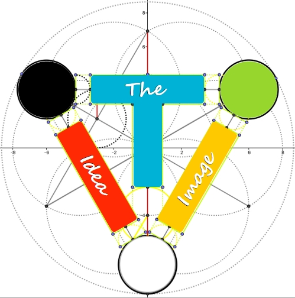
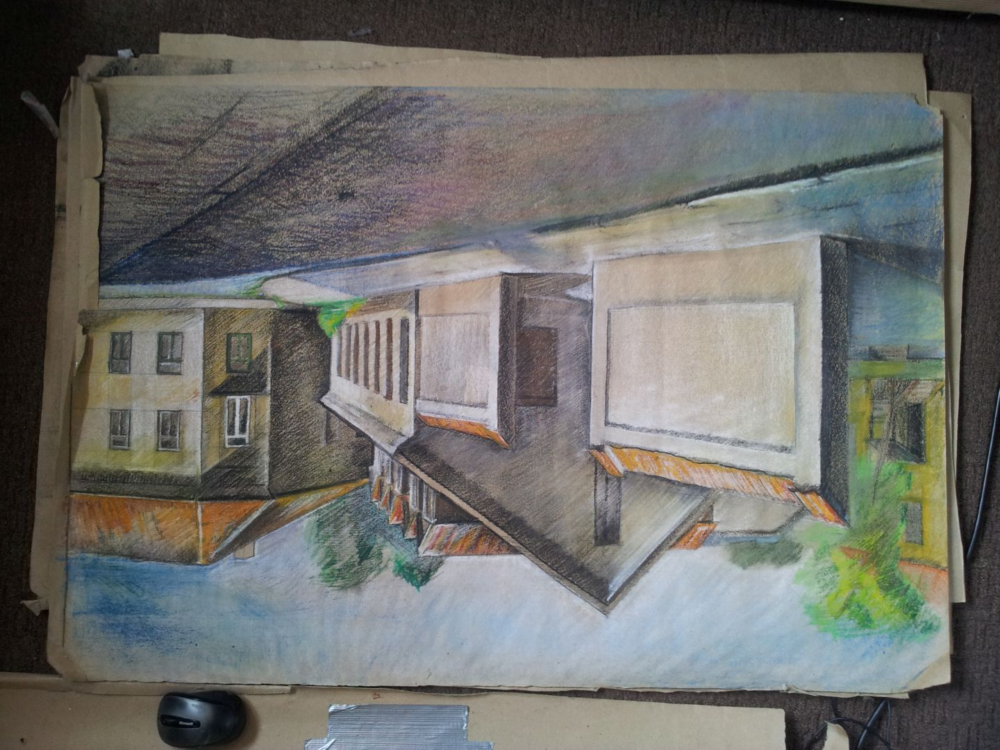
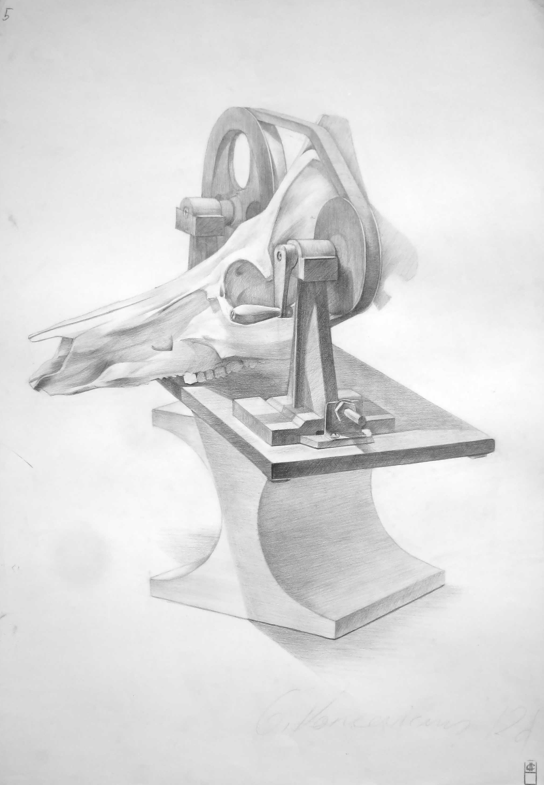
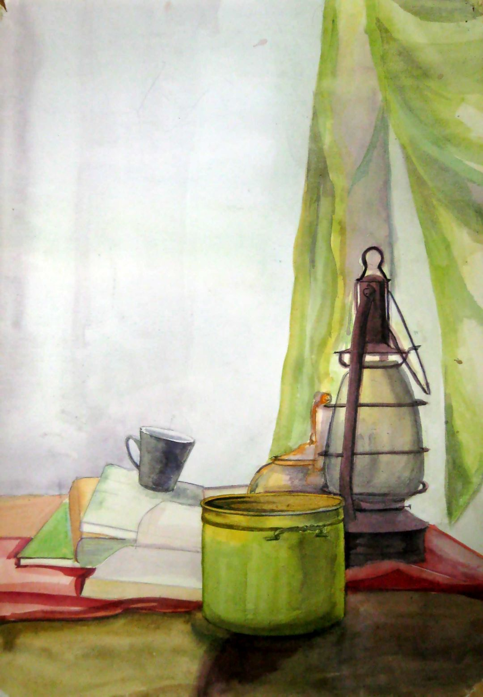

# Gintaras K. - Software Developer

Hello! 👋 I'm a full-stack developer with a strong focus on Angular and backend integrations. With a background in art and design, I've transitioned into software engineering, where I apply creativity and problem-solving to build functional, user-focused applications.

## 🚀 Featured Projects

### LSS (Least Similar Spheres)

**Machine Learning Research Project**

- 🔬 Novel approach to machine learning classification
- 📘 [Research Paper](https://www.researchgate.net/publication/304777963_least_similar_spheres)
- 📝 [Blog Post](https://leastsimilarspheres.blogspot.com/)
- 💻 [GitHub Repository](https://github.com/k-gintaras/lss)

### UFeels

**Emotion Tracking and Analysis App**

- 📱 Track and analyze emotional patterns
- 🎯 Focus on mental wellness and self-awareness
- 💻 [Project Showcase](https://github.com/k-gintaras/UFeels-Showcase)

### Whywhen

**Collaborative Story Creation Game**

- 🎮 Interactive storytelling platform
- 🤝 Multiplayer creative writing experience
- 💻 [Project Showcase](https://github.com/k-gintaras/WhyWhen-Showcase)

### Colorator

**Advanced Color Palette Generator**

- 🎨 Extract color palettes from images
- 🖼️ Generate custom backgrounds
- 💻 [GitHub Repository](https://github.com/k-gintaras/bgr-generator)

### Musicorator

**Music Tagging and Management Tool**

- 🎵 Organize and tag music collections
- 📊 Advanced music metadata management
- 💻 [GitHub Repository](https://github.com/k-gintaras/musicorator)

### Discord Bot Wclogs

**Raid Management and Analysis Tool**

- 🤖 Discord integration for raid management
- 📊 Performance analysis and tracking
- 💻 [Project Showcase](https://github.com/k-gintaras/discord-bot-showcase)

### Taskorator

**Task Management and Hierarchical Structuring Tool**

- 📋 Advanced task organization
- 🗂️ Hierarchical task management
- 💻 [Project Showcase](https://github.com/k-gintaras/overlord-showcase)

## 🛠️ Technical Skills

- **Languages**: TypeScript, JavaScript, Python
- **Frameworks**: Angular, Node.js
- **Design**: UI/UX, Logo Design
- **Research**: Machine Learning, Algorithm Development

## 🎨 Design Philosophy

I believe in creating applications that are not only functional but also visually appealing. Each project includes custom-designed logos and interfaces that enhance user experience while maintaining practical usability.

## 📫 Get in Touch

- k-gintaras@mail.com
- GitHub: You're already here! Feel free to explore my repositories
- ResearchGate: [LSS Research Paper](https://www.researchgate.net/publication/304777963_least_similar_spheres)
- Blog: [LSS Blog](https://leastsimilarspheres.blogspot.com/)

---

_Note: Some projects have private main repositories with public showcase versions available._

## My Logos:

## My Artwork:

![DeviantArt]https://www.deviantart.com/ubaby/gallery

